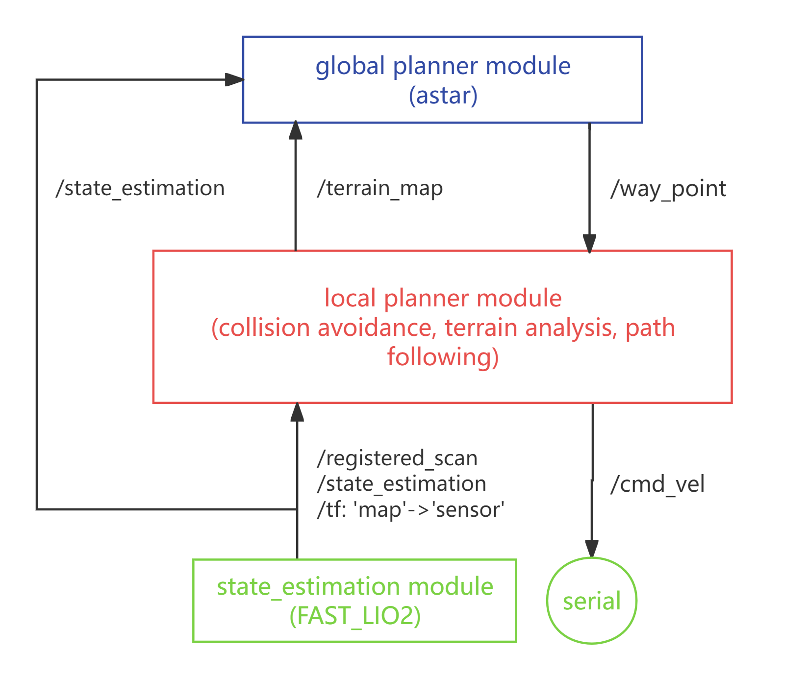

# RCS24_Nav

## OVERVIEW

24赛季导航框架基于[CMU开源的导航系统](https://www.cmu-exploration.com/)，由以下三个主要模块组成：

### State Estimation

状态估计模块使用[FAST_Lio2](https://github.com/hku-mars/FAST_LIO)获取机器人里程计信息。

### Local Planner

局部规划器使用CMU开源的[Autonomous Navigation Modules](https://github.com/HongbiaoZ/autonomous_exploration_development_environment)进行环境的避障、地形分析和路径选择。

### Global Planner

全局规划器采用A*算法在建好的静态栅格地图中搜索路径，发布way_point序列，引导机器人到达指定地点。

## DETAILS

### Dependence

- ubuntu 20.04
- ros noetic

### Livox && FAST_LIO

发布状态估计结果，以及注册的雷达点云数据

### Serial 串口通信

该节点为串口通信节点，订阅`/cmd_vel`话题，将规划出的x轴线速度和y轴线速度发送到下位机。使用ros提供的serial库

### Local Planner

### Global Planner

## DEBUG

- [ ] 添加重定位模块
- [ ] TF_tree
- [ ] 里程计位姿x轴和y轴不对
